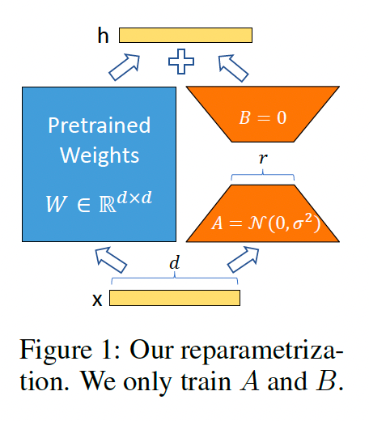

# LLama3-ChatQA-8B的fine-tuning-QLoRA

在深度学习领域，大型预训练语言模型（如LLaMA）已经显示出在各种自然语言处理任务上的卓越性能。然而，这些模型的庞大规模往往伴随着巨大的存储和计算需求。为了解决这一问题，本文将介绍如何使用QLoRA技术和4-bit量化技术来微调大型语言模型，以实现性能和效率的平衡。

## 前置知识：名词解释

- QLoRA（Quantized LoRA）：QLoRA是一种模型微调技术，它通过在模型的注意力机制中引入可学习的低秩矩阵来增强模型的表示能力。这种方法不仅能够显著提升模型的性能，而且由于其低秩特性，还能有效控制参数的增加，从而减少模型的存储和计算需求。



- NF4量化：NF4的全称为：Normalized 4-bit Floating Point Quantization，旨在减少模型的存储和计算需求，同时保持模型性能。在LLM过程训练中，NF4量化可以提高模型的效率，尤其是在资源受限的环境中。
- bitsandbytes： Python 库，提供了对 CUDA 自定义函数的轻量级封装，尤其是针对 8-bit优化器、矩阵乘法和量化函数。

## 代码

### 1 导入库

```python
# 导入必要的库
import os
import torch
from datasets import load_dataset
from transformers import (
    AutoModelForCausalLM,  # 用于加载预训练的语言模型
    AutoTokenizer,  # 用于加载与模型相匹配的分词器
    BitsAndBytesConfig,  # 用于配置4-bit量化
    HfArgumentParser,  # 用于解析命令行参数
    TrainingArguments,  # 用于设置训练参数
    pipeline,  # 用于创建模型的pipeline
    logging,  # 用于记录日志
)
from peft import LoraConfig, PeftModel  # 用于配置和加载QLoRA模型
from trl import SFTTrainer  # 用于执行监督式微调的Trainer
```

### 2 设置模型和数据集

设置预训练模型的名称、数据集名称以及微调后的模型名称。

```python
# 设置预训练模型的名称
model_name = "nvidia/Llama3-ChatQA-1.5-8B"

# 设置要使用的指令数据集名称
dataset_name = "mlabonne/guanaco-llama2-1k"

# 设置微调后模型的名称
new_model = "llama3-8B-fine-tuned"
```

### 3 配置参数

设置QLoRA和4-bit量化的关键参数，包括LoRA的注意力维度、缩放因子、dropout概率，以及4-bit量化的精度和量化类型。

#### 3.1 QLoRA参数配置

```python
lora_r = 64  # LoRA的注意力维度

# Alpha参数用于LoRA缩放
lora_alpha = 16

# LoRA层的dropout概率
lora_dropout = 0.1
```

#### 3.2 bitsandbytes参数配置

```python
# 激活4-bit精度的基础模型加载
use_4bit = True

# 4-bit基础模型的计算数据类型
bnb_4bit_compute_dtype = "float16"

# 4-bit量化类型（fp4或nf4）
bnb_4bit_quant_type = "nf4"

# 激活4-bit基础模型的嵌套量化（双重量化）
use_nested_quant = False
```

#### 3.3 TrainingArguments参数配置

```python
# 输出目录，用于存储模型预测和检查点
output_dir = "./results"

# 训练周期数
num_train_epochs = 10

# 是否启用fp16/bf16训练（在A100上将bf16设置为True）
fp16 = False
bf16 = False

# GPU上每个训练批次的样本数
per_device_train_batch_size = 4

# GPU上每个评估批次的样本数
per_device_eval_batch_size = 4

# 累积梯度的更新步骤数
gradient_accumulation_steps = 1

# 是否启用梯度检查点
gradient_checkpointing = True

# 最大梯度归一化（梯度裁剪）
max_grad_norm = 0.3

# 初始学习率（AdamW优化器）
learning_rate = 2e-4

# 权重衰减，应用于全部layer（不包括bias/LayerNorm的权重）
weight_decay = 0.001

# 优化器
optim = "paged_adamw_32bit"

# 学习率计划
lr_scheduler_type = "cosine"

# 训练步数（覆盖num_train_epochs）
max_steps = -1

# 线性预热的步数比率（从0到学习率）
warmup_ratio = 0.03

# 按长度分组序列
group_by_length = True

# 每X更新步骤保存检查点
save_steps = 0

# 每X更新步骤记录日志
logging_steps = 25

# SFT参数配置
# 最大序列长度
max_seq_length = None

# 打包多个短示例到同一输入序列以提高效率
packing = False

# 将整个模型加载到GPU 0
device_map = {"": 0}
```

### 4 加载数据集

```python
dataset = load_dataset(dataset_name, split="train")
```

### 5 配置量化bitsandbytes

```python
compute_dtype = getattr(torch, bnb_4bit_compute_dtype)

bnb_config = BitsAndBytesConfig(
    load_in_4bit=use_4bit,
    bnb_4bit_quant_type=bnb_4bit_quant_type,
    bnb_4bit_compute_dtype=compute_dtype,
    bnb_4bit_use_double_quant=use_nested_quant,
)
```

### 6 检查GPU与bfloat16的兼容性

```python
if compute_dtype == torch.float16 and use_4bit:
    major, _ = torch.cuda.get_device_capability()
    if major >= 8:
        print("GPU支持bfloat16")

```

### 7 加载模型

#### 7.1 加载基础模型

```python
model = AutoModelForCausalLM.from_pretrained(
    model_name,
    quantization_config=bnb_config,
    device_map=device_map
)
model.config.use_cache = False
model.config.pretraining_tp = 1
```

#### 7.2 加载tokenizer

```python
tokenizer = AutoTokenizer.from_pretrained(model_name, trust_remote_code=True)
tokenizer.pad_token = tokenizer.eos_token
tokenizer.padding_side = "right"  # 修复fp16训练中的溢出问题
```

### 8 加载LoRA配置

```python
peft_config = LoraConfig(
    lora_alpha=lora_alpha,
    lora_dropout=lora_dropout,
    r=lora_r,
    bias="none",
    task_type="CAUSAL_LM",
)
```

### 9 设置TrainingArguments训练参数

```python
training_arguments = TrainingArguments(
    output_dir=output_dir,
    num_train_epochs=num_train_epochs,
    per_device_train_batch_size=per_device_train_batch_size,
    gradient_accumulation_steps=gradient_accumulation_steps,
    optim=optim,
    save_steps=save_steps,
    logging_steps=logging_steps,
    learning_rate=learning_rate,
    weight_decay=weight_decay,
    fp16=fp16,
    bf16=bf16,
    max_grad_norm=max_grad_norm,
    max_steps=max_steps,
    warmup_ratio=warmup_ratio,
    group_by_length=group_by_length,
    lr_scheduler_type=lr_scheduler_type,
    report_to="tensorboard"
)
```

### 10 训练模型

使用`SFTTrainer`进行模型的训练。

```python
# 设置监督式微调参数
trainer = SFTTrainer(
    model=model,
    train_dataset=dataset,
    peft_config=peft_config,
    dataset_text_field="text",
    max_seq_length=max_seq_length,
    tokenizer=tokenizer,
    args=training_arguments,
    packing=packing,
)

# 训练模型
trainer.train()
```

### 11 保存微调后的模型

训练完成后，保存微调后的模型以便后续使用。

```python
trainer.model.save_pretrained(new_model)
```

## 结语

[代码链接](https://github.com/mlzoo/LLM-tutorials-CN/blob/main/notebooks/01-fine-tuning/01-llama3-ChatQA-8B-fine-tuning-QLoRA.ipynb)